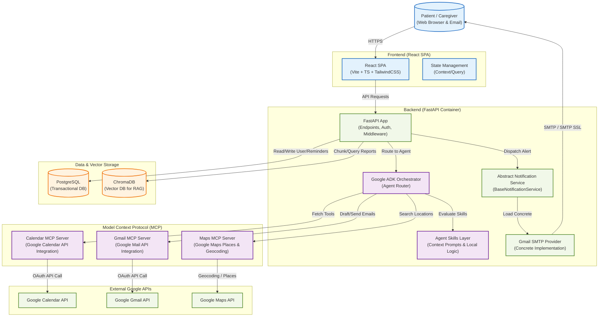

# Architecture Specification: MedAssist AI (Revised)

This document details the high-level architecture, container relations, data flows, and Cloud Run deployment mapping for the MedAssist AI application incorporating the Calendar, Gmail, and Maps MCP servers.

## 1. System Context & Container Diagram

The diagram below shows the containerized boundaries of the application and the interaction between the user interface, backend server, orchestrator, external MCP services, and persistence layers.



## 2. Component Design & Responsibilities

### Frontend (React + TypeScript + TailwindCSS)
- **Role**: Responsive and accessible dashboard for managing healthcare reminders, chats with the agent, uploading documents, and setting caregiver alerts.
- **Styling**: Utilizes TailwindCSS utility framework to construct a high-fidelity, accessible interface.
- **Key Modules**:
  - `ChatWidget`: Real-time streaming interface for patient interactions.
  - `MedicationSchedule`: Calendar visualization showing past intake compliance and upcoming reminders.
  - `EmergencySOSButton`: Immediate visual trigger for alerting caregivers and displaying nearby hospitals.

### Backend (FastAPI)
- **Role**: Exposes secure API endpoints, handles file uploads (summarization RAG pipeline), manages token-based authentication, and coordinates the Google ADK lifecycle.
- **Notification Abstraction**:
  - Exposes an abstract base class `BaseNotificationService`.
  - Exposes `GmailNotificationService` concrete class implementation for the hackathon version.
  - Allows easy drop-in of custom SMS services (e.g. Twilio) later without modifying core alert logic.

### MCP Server Layer
- **Role**: Standardized tool-calling interface for LLMs using the Model Context Protocol.
- **Servers**:
  - `Calendar MCP`: Interfaces with Google Calendar endpoints to schedule doctor appointments directly into calendars.
  - `Gmail MCP`: Enables the agent to query emails or draft follow-up templates directly to medical personnel or caregivers.
  - `Maps MCP`: Interfaces with Google Maps Places and Geocoding APIs to fetch real-world clinic distances.

### Persistence Layer
- **PostgreSQL**: Stores relational structures: users, user-caregiver relations, medication schedules, intake compliance records, and scheduled appointments.
- **ChromaDB**: In-memory or persistent vector database to index parsed medical reports. Standard text embedding models (e.g., Google Vertex AI or OpenAI embeddings) are used to map text chunks.

---

## 3. Cloud Run Deployment Architecture

The production environment maps container instances onto Google Cloud Run, utilizing serverless scalability and secure secrets management.

```mermaid
graph LR
    subgraph Google_Cloud_Platform ["Google Cloud Platform (GCP)"]
        LB["Cloud Load Balancer\n(HTTPS Entry)"]
        
        subgraph Cloud_Run_Services ["Cloud Run"]
            FrontendSvc["Frontend Service\n(Static Assets/SPA Container)"]
            BackendSvc["Backend API Service\n(FastAPI Container)"]
            MCPSvc["MCP Integration Service\n(Calendar/Gmail/Maps Container)"]
        end
        
        subgraph Cloud_Run_Jobs ["Async & Jobs"]
            ReminderJob["Reminder Cron Job\n(Dispatched hourly)"]
        end

        Scheduler["Cloud Scheduler"]
        PubSub["Cloud Pub/Sub"]
        
        subgraph Database_Management ["Managed Databases"]
            CloudSQL[("Cloud SQL\n(PostgreSQL)")]
            AlloyDB[("AlloyDB / ChromaDB Instance\n(Vector Storage)")]
        end

        VPC["Serverless VPC Connector"]
        SecretManager["GCP Secret Manager"]
    end

    %% Routing
    LB -->|| FrontendSvc
    LB -->|/api/*| BackendSvc
    BackendSvc -->|Internal HTTP| MCPSvc
    
    %% Jobs & PubSub
    Scheduler -->|Trigger| ReminderJob
    BackendSvc -->|Publish Event| PubSub
    PubSub -->|Trigger Alert| BackendSvc
    
    %% VPC networking
    BackendSvc --> VPC
    ReminderJob --> VPC
    VPC --> CloudSQL
    VPC --> AlloyDB
    
    %% Security
    SecretManager -.->|Injects DB/API Secrets| BackendSvc
```
