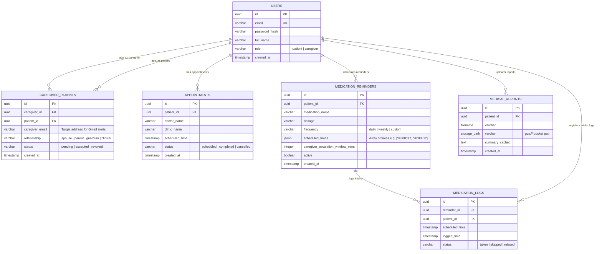

# Database Schema Specification: MedAssist AI (Revised)

This document specifies the persistence layout of MedAssist AI: PostgreSQL for relational, transactional datasets, and ChromaDB for vector-based semantic retrieval.

---

## 1. PostgreSQL Schema (Relational Database)

The relational schema coordinates users, relationships, appointments, medication details, intake logs, and report references.



### Table Definitions & Constraints

#### `users`
- `id`: `UUID` (Primary Key, defaults to `uuid_generate_v4()`)
- `email`: `VARCHAR(255)` (Unique, Indexed, Not Null)
- `password_hash`: `VARCHAR(255)` (Not Null)
- `full_name`: `VARCHAR(100)` (Not Null)
- `role`: `VARCHAR(20)` (Check constraint: `role IN ('patient', 'caregiver')`)
- `created_at`: `TIMESTAMP WITH TIME ZONE` (Defaults to `CURRENT_TIMESTAMP`)

#### `caregiver_patients`
- `id`: `UUID` (Primary Key)
- `caregiver_id`: `UUID` (Foreign Key referencing `users(id)`, cascade delete, Nullable if caregiver has no active user account yet)
- `patient_id`: `UUID` (Foreign Key referencing `users(id)`, cascade delete, Not Null)
- `caregiver_email`: `VARCHAR(255)` (Not Null, the recipient address for Gmail-based caregiver alerts)
- `relationship`: `VARCHAR(50)` (Not Null)
- `status`: `VARCHAR(20)` (Defaults to `'pending'`)
- *Unique Constraint*: `UNIQUE (patient_id, caregiver_email)` to avoid duplicate registration of the same email to one patient.

#### `appointments`
- `id`: `UUID` (Primary Key)
- `patient_id`: `UUID` (Foreign Key referencing `users(id)`)
- `doctor_name`: `VARCHAR(100)` (Not Null)
- `clinic_name`: `VARCHAR(150)` (Not Null)
- `scheduled_time`: `TIMESTAMP WITH TIME ZONE` (Not Null)
- `status`: `VARCHAR(20)` (Check constraint: `status IN ('scheduled', 'completed', 'cancelled')`)

#### `medication_reminders`
- `id`: `UUID` (Primary Key)
- `patient_id`: `UUID` (Foreign Key referencing `users(id)`)
- `medication_name`: `VARCHAR(100)` (Not Null)
- `dosage`: `VARCHAR(50)` (Not Null, e.g. "10mg", "1 tablet")
- `frequency`: `VARCHAR(20)` (Not Null)
- `scheduled_times`: `JSONB` (Array of times e.g., `["08:00:00", "20:00:00"]`)
- `caregiver_escalation_window_mins`: `INTEGER` (Defaults to 30 mins)
- `active`: `BOOLEAN` (Defaults to `true`)

#### `medication_logs`
- `id`: `UUID` (Primary Key)
- `reminder_id`: `UUID` (Foreign Key referencing `medication_reminders(id)`)
- `patient_id`: `UUID` (Foreign Key referencing `users(id)`)
- `scheduled_time`: `TIMESTAMP WITH TIME ZONE` (Not Null)
- `logged_time`: `TIMESTAMP WITH TIME ZONE` (Nullable if missed)
- `status`: `VARCHAR(20)` (Check constraint: `status IN ('taken', 'skipped', 'missed')`)
- *Index*: Composite index on `(patient_id, scheduled_time)` for fast retrieval of schedules.

---

## 2. ChromaDB Schema (Vector/RAG Database)

ChromaDB stores vectorized chunks of medical reports uploaded by patients. These vectors are queried semantically by the ADK Orchestrator to answer questions regarding report history.

### Collection Structure

A single collection named `medical_reports_rag` is shared, using metadata filtering to isolate patient records.

#### Document Struct
- **Document Text**: Raw text chunks parsed from PDF/TXT medical reports.
- **Embedding Vector**: 768-dimension dense vector generated using `text-embedding-004` (Google Vertex AI).

#### Metadata Map
```json
{
  "patient_id": "usr_9018402",
  "report_id": "rep_781903",
  "filename": "blood_panel_june.pdf",
  "chunk_index": 3,
  "created_at": "2026-06-23T09:50:00Z"
}
```

### Chunking Protocol
- **Parser**: PyPDF2 or pdfplumber to extract raw text lines.
- **Text Splitter**: Recursive Character Text Splitter.
- **Chunk Size**: `500` characters.
- **Chunk Overlap**: `50` characters.
- **Retrieval Filter**:
  ```python
  collection.query(
      query_embeddings=[query_vector],
      n_results=4,
      where={"patient_id": current_patient_id}
  )
  ```
